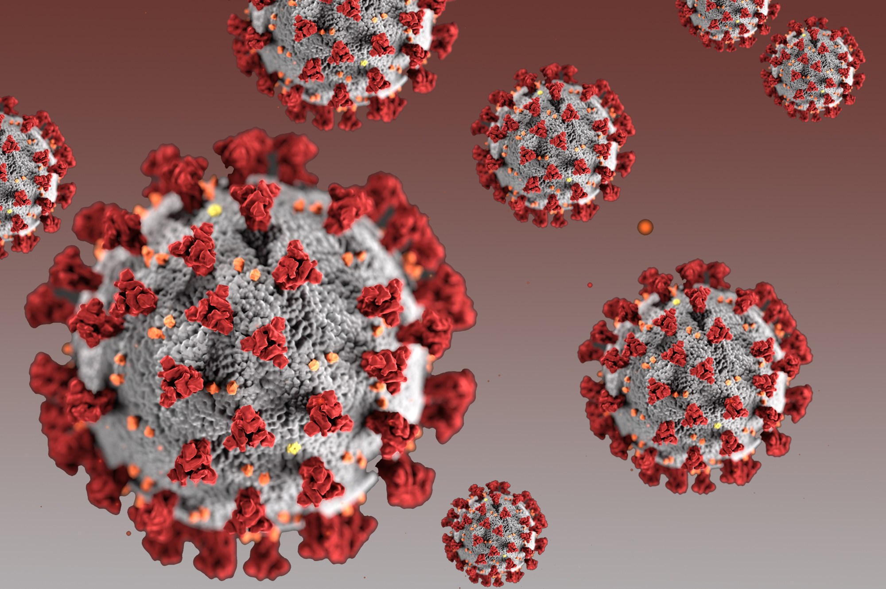

<p>

</p>

# Coronavirus-Research

**Authors**: Ning Chen, Michael Pozenvasser

## Overview
This project investigated the effect of coronaviurs to baby, toddler, teenager, young adult, middle-age and elder.


## Business Problem


## Data

API, web scrapping, dataset


## Methods

logistic regression, random forest bagging,  gridsearch + XGboost


## Results


***

### Visualization


## Conclusions


## For More Information

Please review our full analysis in [our Jupyter Notebook](https://github.com/ghcn345/Coronavirus-Research) or our [presentation]().

For any additional questions, please contact **Ning Chen—chen.ning345@gmail.com, Michael Pozenvasser**.

## Repository Structure

Description of the structure of the repository and its contents:

```
├── README.md                           <- The top-level README for reviewers of this project
├── project_coronavirus                 <- Narrative documentation of analysis in Jupyter notebook
├── Project_Presentation.pdf            <- PDF version of project presentation
├── data                                <- Both sourced externally and generated from code
└── images                              <- Both sourced externally and generated from code

```
